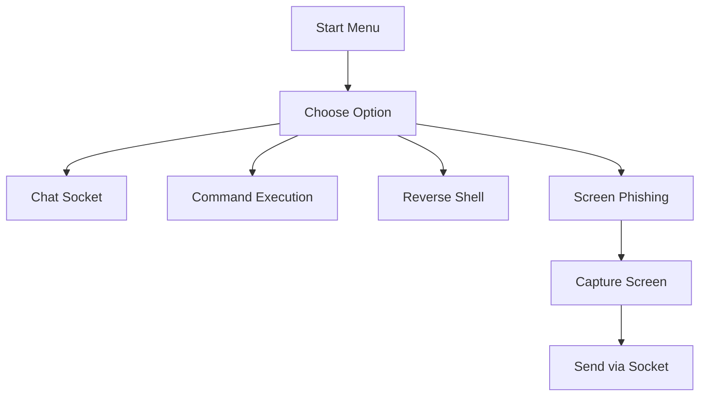

## ✅ `README.md` for `socket_server`

# 🔌 Socket Server Suite – Multi-Function Network Toolset

A modular and powerful collection of socket-based tools for remote communication, system access, and phishing simulation. This project includes multiple socket client-server implementations for use in ethical hacking demonstrations, cybersecurity learning, and network programming practice.

---

## 📂 Modules Included

| Module                | Description                                                                 |
|-----------------------|-----------------------------------------------------------------------------|
| `chat_socket`      | Basic two-way messaging client-server over TCP                             |
| `command_socket`   | Execute terminal commands remotely and return results                      |
| `reverse_shell`    | Connects back to attacker and gives shell access from the victim's machine |
| `screen_phishing`  | Simulates phishing via screenshot capture and transfer                     |
| `complete_script`  | Merged version with selectable modules via menu                            |

---

## 🚀 Features

- 🔁 **Bi-directional chat** over raw sockets
- 🖥️ **Remote command execution** (like netcat)
- 🐚 **Reverse shell** setup for penetration testing
- 📸 **Screen capture phishing simulation**
- ✅ Simple menu-driven interface (in `complete_script.py`)
- 🔐 Educational design: clear, modular, and hackable

---

## 🧠 Architecture Overview

### CLI Menu System (in `complete_script.py`):

```plaintext
+----------------------------+
|      Main Menu            |
|---------------------------|
| 1. Chat Server            |
| 2. Command Execution      |
| 3. Reverse Shell          |
| 4. Screen Capture Phishing|
+----------------------------+
````

---

## 🔧 Installation

### Requirements

* Python 3.8+
* `Pillow` library (for screenshot feature)
* Internet access (or localhost test environment)

### Install dependencies

```bash
pip install -r requirements.txt
```

For `screen_phishing.py`:

```bash
pip install pillow
```

---

## 🧪 Usage

### Chat Server

**Terminal 1 (Server):**

```bash
python chat_socket.py
```

**Terminal 2 (Client):**

```bash
python chat_socket.py
```

---

### Reverse Shell

**Victim machine:**

```bash
python reverse_shell.py
```

**Attacker (listening):**

```bash
nc -lvp 4444
```

---

## 📊 Technology Stack

* Python `socket`, `threading`, `subprocess`, `os`
* Optional: `Pillow` for screenshot capture
* Netcat / Terminal utilities for reverse shell

---

## 📉 Project Flow (Mermaid Diagram)



---

## 🔐 Disclaimer

This project is strictly for **educational, research, and demo** purposes in ethical cybersecurity.
**Never deploy or run** this code on systems without permission. Use responsibly.

---

## 🧑‍💻 Author

**Nitin Pandey**
[GitHub](https://github.com/Nitin192005) | [LinkedIn](https://linkedin.com/in/nitin-pandey-dev)

---

## ⭐ Support

If you found this project useful or learned something from it, feel free to star ⭐ the repo and contribute!
